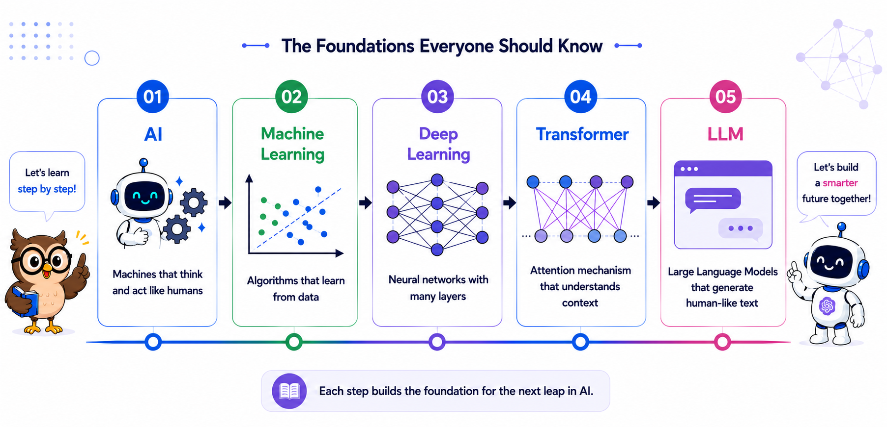
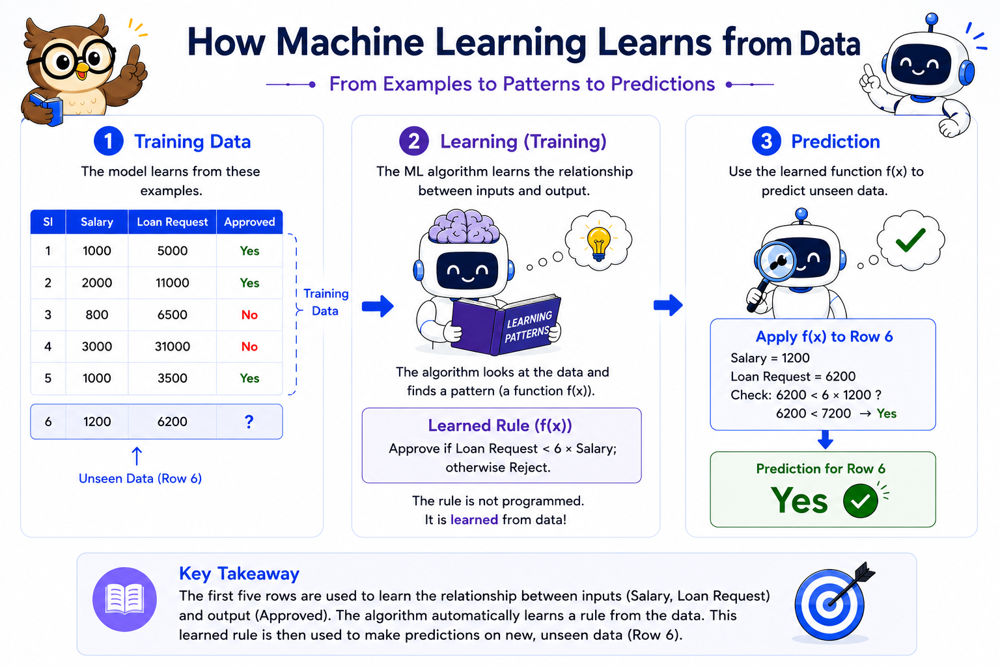
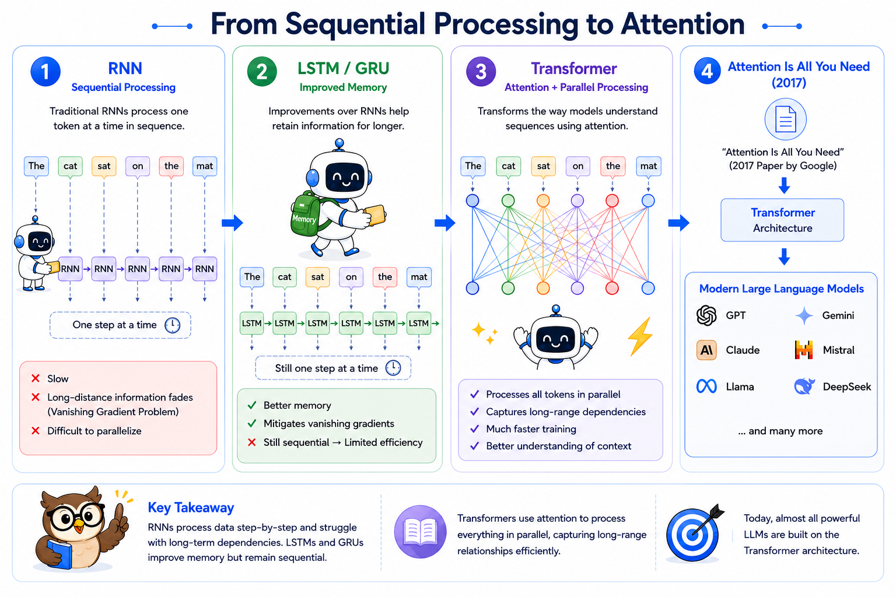
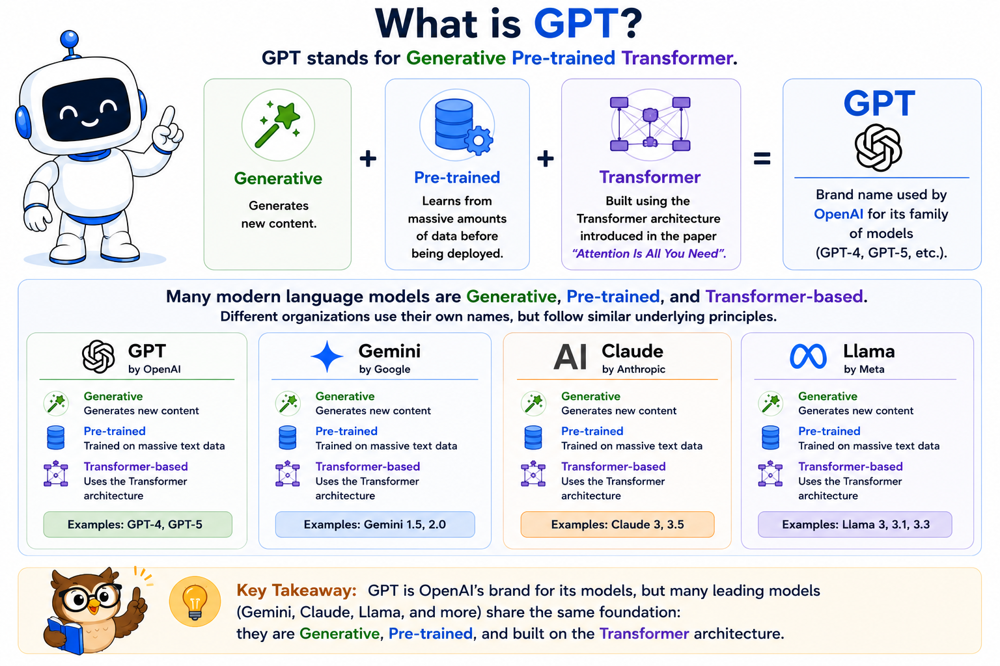
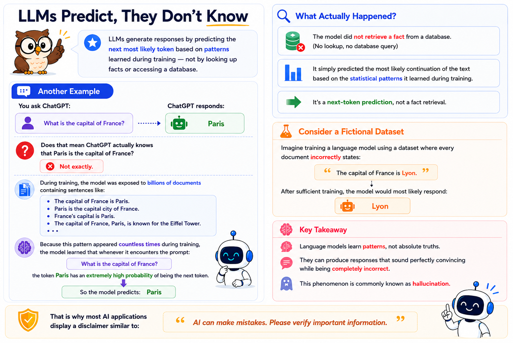
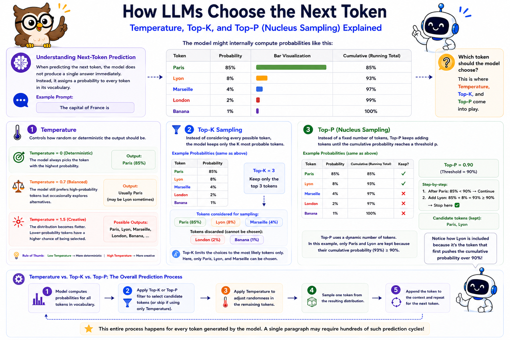
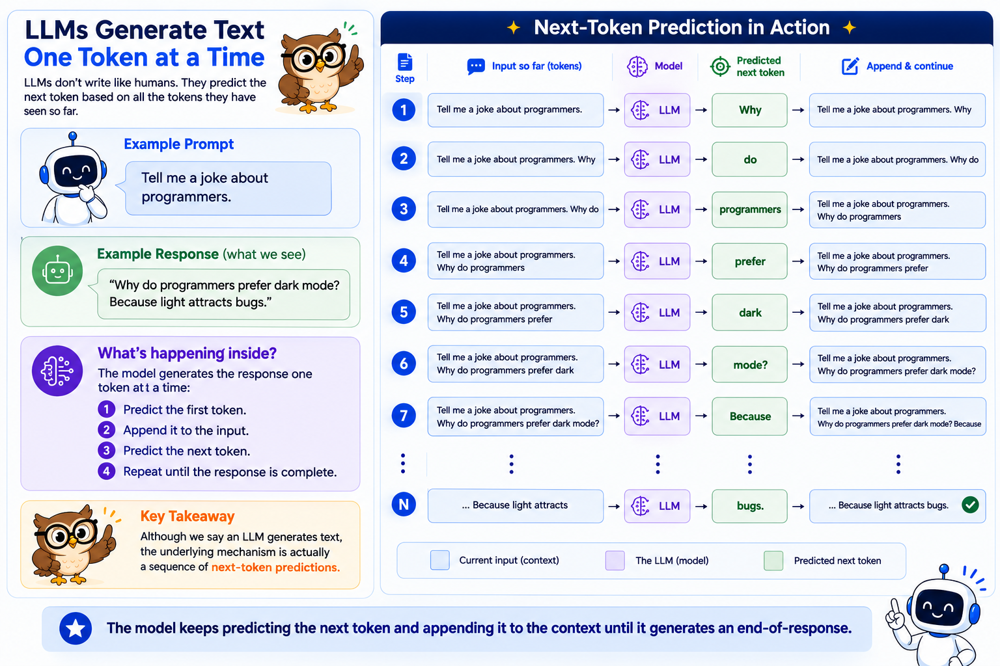

#### GENERATIVE AI • FOUNDATIONS

# Understanding LLMs without the hype

#### Explore AI, Machine Learning, Transformers, GPT, and LLMs through an intuitive visual guide to Generative AI.

Millions of people use ChatGPT every day. Yet very few understand what actually happens after they press Enter. At first glance, these capabilities may seem almost magical. But behind every **Large Language Model (LLM)** lies decades of innovation in **Artificial Intelligence (AI)**, **Machine Learning (ML)**, **Deep Learning (DL)**, and the **Transformer** architecture. In this article, we'll explore the journey from AI to LLMs, building an intuitive understanding of the key concepts that power today's Generative AI. Rather than diving into complex mathematics, we'll focus on the foundations that every AI practitioner should know.

## **Let us start with understanding Artificial Intelligence (AI) and Machine Learning (ML)**

> **Artificial Intelligence (AI)** is the field of computer science focused on building systems that can perform tasks that normally require human intelligence, such as reasoning, learning, problem-solving, language understanding, and decision-making.

One of the most important branches of AI is **Machine Learning (ML)**. Rather than explicitly programming a computer with rules for every possible situation, Machine Learning enables systems to learn patterns directly from data. Once trained, the model can apply those learned patterns to make predictions on previously unseen data.

> **Machine Learning (ML)** is a branch of Artificial Intelligence (AI) that learns patterns from data and uses those patterns to make predictions or decisions on new, unseen data.

The example above demonstrates **Supervised Machine Learning**, where the model learns from labeled data (data with known outputs). Machine Learning also includes **Unsupervised Learning**, where the model discovers patterns or groups in unlabeled data without predefined answers.

Within Supervised Learning, problems are commonly divided into:

- **Classification** – Predicting a category (e.g., Spam vs. Not Spam, Fraud vs. Legitimate)
- **Regression** – Predicting a continuous numerical value (e.g., House Price, Electricity Consumption)

There are many more Machine Learning algorithms and techniques beyond these categories. Rather than exploring each one in detail, it's important to understand that they are all built upon mathematical concepts such as Probability, Statistics, Linear Algebra, Calculus, and Optimization.

For decades, these algorithms have solved a wide variety of real-world problems with remarkable success. Understanding them in depth is an entire field of study in itself. However, for our journey toward understanding **Large Language Models (LLMs)**, developing an intuition that these techniques exist—and the problems they solve—is sufficient.

Traditional Machine Learning algorithms perform exceptionally well on **structured data**. However, as datasets became larger and more complex, their limitations started becoming apparent.

## **Purpose and Evolution of Deep Learning**

Traditional Machine Learning algorithms perform exceptionally well on structured data. However, as datasets grew larger and more complex, their limitations became increasingly apparent.

Consider problems such as:

- Millions of sensor readings generated daily by IoT devices
- Image classification and object detection
- Speech recognition
- Natural language processing
- Time-series forecasting
- Video understanding

For these tasks, designing handcrafted features became increasingly difficult and often required significant domain expertise. Researchers needed models capable of automatically learning complex representations directly from raw data.

This led to the emergence of **Deep Learning**.

> **Deep Learning** is a specialized branch of Machine Learning that uses Artificial Neural Networks (ANNs) with multiple hidden layers to automatically learn increasingly complex patterns from data.

Over time, different neural network architectures were developed for different types of data:

- **ANN (Artificial Neural Network)** – Structured (tabular) data
- **CNN (Convolutional Neural Network)** – Images and computer vision
- **RNN (Recurrent Neural Network)** – Sequential data such as text, speech, and time series

The diagram below summarizes the major milestones in the evolution of sequence models, showing how each architecture addressed the limitations of its predecessor and ultimately led to the Transformer architecture that powers today's Large Language Models.

## **Common Questions About Large Language Models (LLMs)**

Now that we've built the foundations, let's answer some common questions and clear up a few misconceptions about Large Language Models. We will start with the definition of **Large Language Model (LLM)**:

> A **Large Language Model (LLM)** is a type of **Generative AI (Gen AI)** model built on the **Transformer** architecture and trained on massive amounts of text. By learning patterns, grammar, context, and relationships within language, it can understand and generate human-like text, enabling tasks such as question answering, summarization, translation, reasoning, and code generation.

### Q1. Are LLMs the only type of Generative AI model?

**Answer:** No. Large Language Models (LLMs) are just **one category of Generative AI models**. While LLMs specialize in generating and understanding **text**, there are many other generative models designed for different types of data.

Examples include:

- Text → Image
- Text → Speech
- Speech → Text
- Speech → Speech
- Text → Video
- Image → Image
- Image → Video

Many of these modern models are also based on the **Transformer architecture**, although they are not technically Large Language Models because they are not designed primarily for text generation.

---

### Q2. Are GPT and LLM the same?

**Answer:** Not exactly. Technically, many modern language models—including **Gemini**, **Claude**, **Llama**, and **GPT**—are all **Generative**, **Pre-trained**, and **Transformer-based** models.

However, **GPT** is the branding used by **OpenAI** for its family of models (GPT-4, GPT-5, etc.). Other organizations use different names for their own models even though they follow similar underlying principles.

Let us understand the details

---

### Q3. Are GPT and ChatGPT the same?

**Answer:** No.

Although the names are similar, **GPT** and **ChatGPT** are **not the same thing**.

- **GPT** is the underlying **Large Language Model (LLM)** developed by OpenAI.
- **ChatGPT** is an **AI application** built on top of GPT models.

Think of GPT as the **engine**, while ChatGPT is the **car** that uses that engine.

---

### Q4. Is an LLM really generating text, or is it just predicting?

**Answer:** At its core, an LLM is predicting.

An LLM repeatedly predicts the **next most likely token (token can be considered as a word for now)** based on all the tokens that came before it.

The image below describes what happens when we prompt an LLM with a prompt like "Tell me a joke about programmers"

---

### Q5. Does an LLM know facts?

**Answer:** Not in the way humans do.

LLMs do not store facts in a database or reason like humans. Instead, they generate responses by predicting the most likely sequence of tokens based on the patterns learned during training.

Because of this, they can sometimes produce:

- Incorrect information
- Outdated information (knowledge cutoff)
- Fabricated information (hallucinations)

Modern AI systems overcome many of these limitations using techniques such as:

- Retrieval-Augmented Generation (RAG)
- Grounding
- Tool Calling
- Web Search

These techniques allow the model to retrieve up-to-date and authoritative information instead of relying solely on its training data (We will see these in detail in a future article).

---

### Q6. How does an LLM choose the next token? Can I control it?

**Answer:** Yes.

After assigning probabilities to possible next tokens, the model uses a **sampling strategy** to decide which token to generate.

Some common sampling parameters include:

- **Temperature** – Controls randomness and creativity. Lower values produce more deterministic outputs, while higher values encourage more diverse responses.

- **Top-k Sampling** – Restricts the model to selecting the next token from the **top _k_ most probable** candidates.

- **Top-p (Nucleus Sampling)** – Selects the next token from the **smallest set of tokens whose cumulative probability reaches or exceeds _p_**.

Changing these parameters influences whether the model produces more deterministic or more creative responses.

However, many modern models—such as **GPT-5**—either do not expose these parameters or encourage users to achieve the desired behavior through **effective prompting** instead of manually tuning sampling values.

## **Conclusion and Next Steps**

Modern LLMs may seem magical, but they are built on decades of research in AI, Machine Learning, Deep Learning, and the Transformer architecture.

In this article, we explored the journey from **Artificial Intelligence (AI)** to **Machine Learning (ML)**, **Deep Learning (DL)**, the **Transformer architecture**, and finally **Large Language Models (LLMs)**. Along the way, we also clarified several common misconceptions, including the relationship between **GPT and LLMs**, how **LLMs generate text through next-token prediction**, why they can sometimes produce incorrect information, and how parameters such as **Temperature**, **Top-K**, and **Top-P** influence the generation process.

Although modern LLMs appear remarkably intelligent, they are fundamentally **pattern-learning systems** that predict one token at a time based on the context they have seen so far. Understanding these foundations is essential before building applications powered by Generative AI.

In the [**next article**](https://github.com/majumderanurup/articles/blob/main/02_Build%20Smarter%20Apps%20With%20Generative%20AI%20and%20Prompt%20Engineering.md) we'll move from theory to practice. We'll explore how LLMs can be integrated into **custom AI applications** and learn **Prompt Engineering** techniques for obtaining more accurate and reliable responses.
