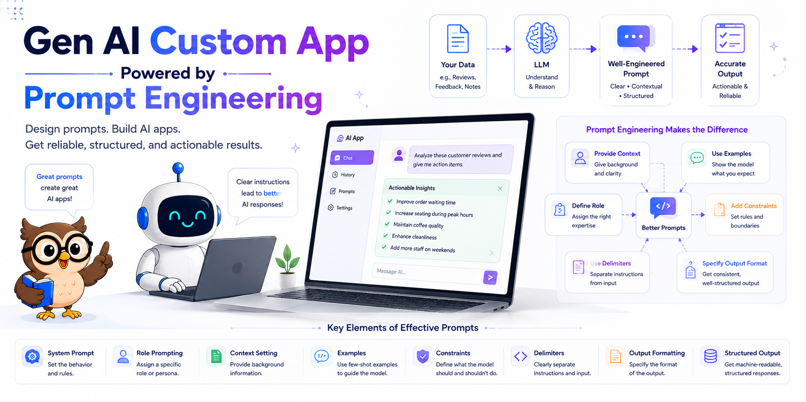
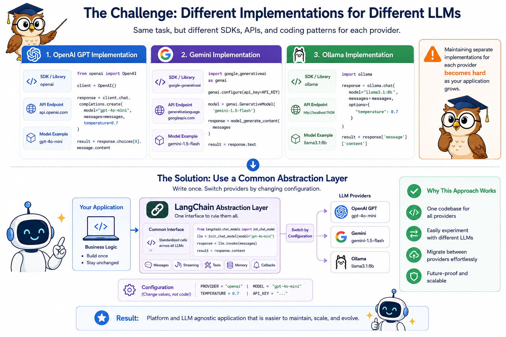
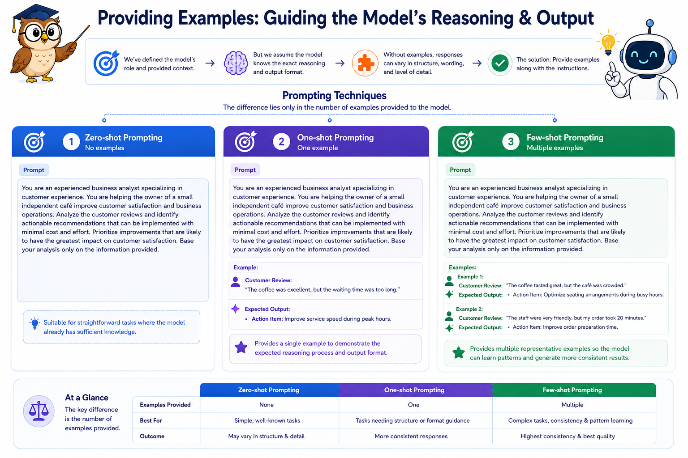
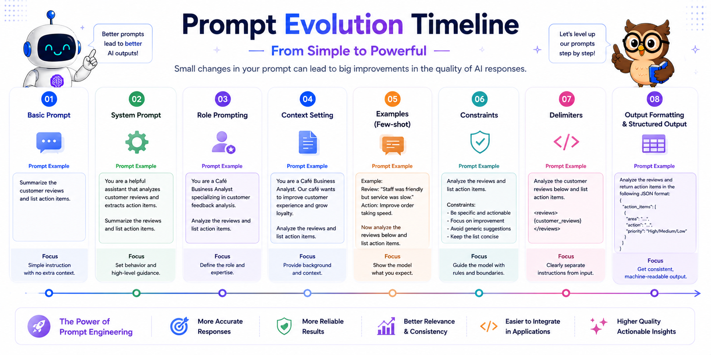

#### GENERATIVE AI • FOUNDATIONS

# Supercharge your app with Generative AI and Prompt Engineering

#### A hands-on guide to integrating large language models into your applications using proven prompt engineering techniques.

In the [**previous article**](https://github.com/majumderanurup/articles/blob/main/01_Understanding%20LLMs%20without%20the%20hype.md), we built a strong foundation by exploring how **LLMs** work—from **AI, Machine Learning, and Transformers** to **GPTs** and modern **Generative AI** models. Now it's time to put that knowledge into practice.

Many modern applications use **Generative AI** to deliver smarter, more personalized user experiences. In this article, we'll learn how to integrate generative AI into our own applications and apply practical **Prompt Engineering** techniques to produce more accurate, reliable, and useful AI responses.

> **Assumption:** Rather than building an entire application, we'll focus exclusively on the **Generative AI** component. This functionality can be integrated into virtually any application, regardless of its overall architecture.

We'll use **Python** throughout this article because it is the most widely used programming language for AI development. However, the concepts and techniques discussed are language-agnostic—the only differences in other languages are the SDKs, libraries, and syntax.

If you're a non-technical reader, don't worry about understanding every line of code. Feel free to treat the code examples as a black box and focus on the underlying concepts and intuition behind how generative AI applications work.

## Let's build a simple real-world example

Suppose you own a café, and customers regularly leave reviews about your food, service, and overall experience. While reading every review manually is possible, it quickly becomes difficult as the number of reviews grows.

Instead of simply knowing whether a review is positive or negative, you want to identify **actionable insights** that can help improve the customer experience. For example, customers might mention slow service, friendly staff, long waiting times, or excellent coffee. These are valuable insights that can guide business decisions.

Since customers can write reviews in countless ways using different tones, styles, and levels of detail, extracting consistent information manually is challenging. This is where **Large Language Models (LLMs)** excel. We'll use an LLM to analyze each review and extract the key insights along with actionable items that the café owner can use to improve products and services.


Our solution will look something like this.

To begin, we'll implement the same solution using three different LLM providers:

- **OpenAI's GPT** series
- **Google's Gemini** series
- **Ollama**, which provides a free and locally runnable alternative

The full example can be found in [github](https://github.com/majumderanurup/prompt-engineering.git)

Once we've built the solution with each provider, we'll refactor it to make the implementation **Platform and LLM agnostic**, allowing us to switch between models with minimal code changes.

Finally, we'll improve the quality of the generated results by applying **Prompt Engineering** techniques and observing how even small changes to the prompt can significantly enhance the AI's responses.

We will use the following 10 reviews throughout for benchmarking and comparing solutions

1. The coffee was excellent and the pastries were fresh. However, it took almost 20 minutes for someone to take our order. The staff apologized, but the service definitely needs to be faster.

2. Loved the ambience! It's a perfect place to work with free Wi-Fi and comfortable seating. I'll definitely be coming back.

3. The cappuccino was average, and my sandwich arrived cold. The staff was friendly, but the kitchen seemed overwhelmed during lunch hours.

4. Amazing desserts! The chocolate brownie is a must-try. The only downside was that finding a table during the evening was difficult.

5. The café was clean, the staff greeted us with a smile, and our order arrived quickly. One of the best customer experiences I've had.

6. The coffee tasted burnt and the music was so loud that we couldn't have a conversation. I expected much better.

7. Great variety of beverages, but the prices are slightly higher than nearby cafés. Everything else was excellent.

8. I ordered a latte with almond milk, but I received regular milk instead. Thankfully, the staff replaced it immediately without any hassle.

9. The food was delicious, but the washroom wasn't clean. Small details like cleanliness make a big difference.

10. Visited on a Sunday afternoon. There was a long queue, but once we got seated, the food and coffee were fantastic. It would help if there were more staff during weekends.

## Implementation using Open AI

First we need to get the API key for Open AI

1. Visit https://platform.openai.com
2. Sign in with your OpenAI account.
3. Complete account verification (if prompted).
4. Add a payment method or prepaid credits under Billing.
5. Navigate to API Keys.
6. Click Create new secret key.
7. Give your API key a name (optional but recommended).
8. Click Create secret key.
9. Copy and securely save the API key (it won't be shown again).
10. Place the key in a .env file in your code repository like below

```
OPENAI_API_KEY=<YOUR_OPENAI_API_KEY>
```

The implementation will look something like below

```python
def find_action_items(reviews: list[str]) -> str:
    """Find actionable recommendations from customer reviews using OpenAI's GPT-5 model.

    Args:
        reviews (list[str]): Customer reviews

    Returns:
        str: A list of actionable recommendations extracted from the reviews.
    """
    llm = OpenAI(api_key=os.getenv("OPENAI_API_KEY"))
    prompt = f"""Analyze the following reviews and summarize the key action items considering the reviews {"\n".join(reviews)}."""
    action_items = llm.responses.create(model="gpt-5", input=prompt).output_text
    return action_items
```

And this is what we get as output

```
Here are the key action items distilled from the reviews, prioritized by impact and frequency:

1) Speed and staffing
- Reduce order-taking wait times (target: greet within 2 minutes; orders placed within 5 minutes).
- Add floor/barista coverage during peaks (lunch, evenings, weekends); create a weekend staffing plan.
- Consider queue/waitlist tools, QR/mobile ordering, or a counter “runner” during rushes.

2) Kitchen throughput and food temperature
- Ensure hot items are served hot: add expo temperature checks, tighten holding/warming procedures, and review lunch-hour prep and line setup.
- Track ticket times (goal: <12 minutes at lunch) and adjust prep/pars as needed.

3) Beverage quality and consistency
- Address “burnt” coffee feedback: recalibrate grinders, verify brew/extraction temps, rotate beans properly, and tighten cleaning schedules.
- Refresh barista training and SOPs for espresso and milk texturing.

4) Order accuracy, especially milk/dietary requests
- Implement order read-back and cup labeling; require POS modifiers for alt-milks/allergens.
- Train on allergen protocol and cross-contamination prevention; add a final handoff check.

5) Seating and capacity management
- Ease evening and weekend crowding: introduce a waitlist/reservations for peak hours, bus tables faster, and add/redistribute seating where possible.
- If laptop use limits evening capacity, consider time or zone guidelines during peaks.

6) Noise and ambience control
- Set music volume standards by daypart; balance speaker zones to keep conversation-friendly levels.

7) Cleanliness, especially restrooms
- Institute hourly restroom checks with a visible log; ensure restocking and quick-response cleaning.
- Maintain overall café cleanliness consistency.

8) Pricing and value perception
- If keeping a slight premium, reinforce value with quality, portions, and speed.
- Consider loyalty program, bundle deals, or off-peak promos to offset price sensitivity.

9) Preserve strengths
- Keep up: friendly staff, fresh pastries/desserts, clean café, quick service when it works, free Wi‑Fi and comfortable seating.

Suggested KPIs to monitor
- Time to greet/order: ≤5 minutes
- Average ticket time (lunch): ≤12 minutes
- Drink/food accuracy: ≥99%
- Restroom checks: hourly, 100% compliance
- Music volume: maintain conversation-friendly levels
- Peak coverage: scheduled staffing meets forecasted demand
- Waitlist/table turn at peaks: average wait ≤10 minutes

These actions address slow service, kitchen delays, drink quality/accuracy, cleanliness, noise, and peak-time capacity while protecting what guests already love.
```

## Implementation using Google Gemini

Now let us get the API key another LLM provider, Gemini

1. Visit https://aistudio.google.com
2. Sign in with your Google account.
3. Accept the terms and complete the initial setup (if prompted).
4. Click Get API Key from the left sidebar or top menu.
5. Select Create API Key.
6. Choose an existing Google Cloud project or create a new one.
7. Click Create API Key.
8. Copy and securely save the generated API key.
9. Place the key in a .env file in your code repository like below.

```
GEMINI_API_KEY=<YOUR_GEMINI_API_KEY>
```

The implementation will look something like below

```python
def find_action_items(reviews: list[str]) -> str:
    """Find actionable recommendations from customer reviews using Google Gemini's model.

    Args:
        reviews (list[str]): Customer reviews

    Returns:
        str: A list of actionable recommendations extracted from the reviews.
    """
    llm = genai.Client(api_key=os.getenv("GEMINI_API_KEY"))
    prompt = f"""Analyze the following reviews and summarize the key action items considering the reviews {"\n".join(reviews)}."""
    action_items = llm.models.generate_content(
        model="gemini-3.1-flash-lite", contents=prompt
    ).text
    return action_items
```

We will get a new output for gemini the output will not be exact as openai but somewhat similar.

## Implementation using Ollama

Although this a free option but we need to do some installation before we can start using them

1. Visit https://ollama.com/download.
2. Download and install Ollama for your operating system.
3. Verify the installation by running ollama --version.
4. Pull the LLM you want to use (e.g., ollama pull llama3.1).
5. Ensure the Ollama server is running (ollama serve, if not started automatically).
6. Verify the downloaded models using ollama list.
7. Connect to your locally running Ollama instance from your application.

The implementation will look something like below

```python
def find_action_items(reviews: list[str]) -> str:
    """Find actionable recommendations from customer reviews using Ollama's Qwen-3 model.

    Args:
        reviews (list[str]): Customer reviews

    Returns:
        str: A list of actionable recommendations extracted from the reviews.
    """
    prompt = f"""Analyze the following reviews and summarize the key action items considering the reviews {"\n".join(reviews)}."""
    action_items = llm(
        model="qwen3:14b",
        messages=[
            {
                "role": "user",
                "content": prompt,
            }
        ],
    ).message.content
    return action_items
```

We will get a new output for ollama the output will not be exact as openai or gemini but somewhat similar.

## Implementation using LangChain

As you can see, the three implementations use different SDKs, APIs, and coding patterns. While they all accomplish the same task, maintaining separate implementations for each LLM provider quickly becomes difficult as your application grows.

To make our solution **Platform and LLM agnostic**, we can use a common abstraction layer or wrapper library like LangChain. This allows us to write the application logic once while switching between different providers simply by changing configuration values, such as the provider or model name.



With this approach, the core application code remains unchanged, making it easy to experiment with different LLMs or migrate between providers without rewriting your business logic.

The implementation will look something like below

```python
def find_action_items(
    reviews: list[str], model_name: str, model_provider: str, model_api_key: str = None
) -> str:
    """Find actionable recommendations from customer reviews using LangChain.

    Args:
        reviews (list[str]): Customer reviews

    Returns:
        str: A list of actionable recommendations extracted from the reviews.
    """
    llm = init_chat_model(
        model=model_name,
        model_provider=model_provider,
        api_key=model_api_key,
    )
    prompt = f"""Analyze the following reviews and summarize the key action items considering the reviews {"\n".join(reviews)}."""
    action_items = llm.invoke(prompt).content
    return action_items
```

Again we will get not be exact as earlier but somewhat similar output.

## Prompt Engineering

Now we will see several Prompt Engineering techniques which will make our solution better.

### System Prompt + User Prompt

When we use a single prompt, it becomes difficult to separate different concerns such as the model's role, behavior, constraints, and the actual user request. As the prompt grows, it becomes harder to maintain, reuse, and modify.

Let's see how we can implement this approach using LangChain.

```python
def find_action_items(
    reviews: list[str], model_name: str, model_provider: str, model_api_key: str = None
) -> str:
    """Find actionable recommendations from customer reviews using a language model.

    Args:
        reviews (list[str]): Customer reviews
        model_name (str): Model name to be used for generating action items
        model_provider (str): Model provider to be used for generating action items
        model_api_key (str, optional): Model API Key. Defaults to None.

    Returns:
        str: A list of actionable recommendations extracted from the reviews.
    """
    llm = init_chat_model(
        model=model_name,
        model_provider=model_provider,
        api_key=model_api_key,
    )
    merged_reviews = "\n".join(reviews)
    messages = [
        SystemMessage(content="Analyze the following reviews and summarize the key action items."),
        HumanMessage(content=f"Consider the following reviews :\n{merged_reviews}"),
    ]
    action_items = llm.invoke(messages).content
    return action_items
```

For the upcoming sections we will just update majorly the System Prompt.

### Role Prompt

Although we have separated the prompt into a System Prompt and a User Prompt, the system prompt still only describes what the model should do. It doesn't define who the model should be while performing the task.

For example, our current system prompt is:

> Analyze the following comments and summarize the key action items.

Since no role is assigned, the model is free to decide its own perspective. It might analyze the reviews as a customer, a café owner, a general assistant, or a business analyst. As a result, the responses can vary in depth, tone, and focus.

The Solution is Role Prompting which assigns the model a specific identity or expertise before giving it the task. By clearly defining the role, we guide the model to approach the problem from the desired perspective, leading to more consistent and relevant responses.

Updated System Prompt will look like

> You are an experienced business analyst specializing in customer experience. Analyze the following customer reviews and identify actionable recommendations that can help the café owner improve customer satisfaction and business operations.

Role Prompting improves the quality and consistency of responses by explicitly defining the model's expertise before assigning it a task. A well-defined role helps the model produce outputs that better align with your application's goals.

### Context Setting

Our current system prompt defines **who** the model is, but it still lacks sufficient **context** about the task and the business objective.

For example, our current system prompt is:

> You are an experienced business analyst specializing in customer experience. Analyze the following customer reviews and identify actionable recommendations that can help the café owner improve customer satisfaction and business operations.

While the model now understands its role, it still has to make assumptions about the context. Is the café a small local business or a large chain? Should it prioritize customer satisfaction, operational efficiency, cost reduction, or revenue growth? Should it recommend long-term strategic changes or focus only on improvements that can be implemented immediately?

Without sufficient context, the model may generate recommendations that are technically correct but not aligned with the actual objective.

The solution is **Context Setting**, which provides the model with the necessary background information, objectives, constraints, and audience before assigning the task. By supplying this additional context, we reduce ambiguity and help the model produce responses that are more relevant and aligned with the business goals.

Instead of only defining **who** the model is, also explain **why** it is performing the task and **what success looks like**.

Updated System Prompt will look like:

> You are an experienced business analyst specializing in customer experience. You are helping the owner of a small independent café improve customer satisfaction and business operations. Analyze the customer reviews and identify actionable recommendations that can be implemented with minimal cost and effort. Prioritize improvements that are likely to have the greatest impact on customer satisfaction. Base your analysis only on the information provided.

Context Setting helps the model understand the bigger picture, not just the task. Providing background information, objectives, audience, and constraints enables the model to generate responses that are more relevant, practical, and aligned with the intended outcome.

### Zero-shot, One-shot and Few-shot Prompting

So far, we have defined the model's role and provided sufficient context for the task. However, we still assume that the model inherently understands the exact reasoning process and output format we expect.



In general, adding high-quality examples helps the model better understand the expected reasoning process and output format, resulting in responses that are more accurate, consistent, and predictable. In different scenarios zero shot or one shot examples can be more effective than few shot examples. However, for the current problem let us take few shot examples and move forward.

### Constraints

Our prompt now defines the model's role, provides context, and includes examples. However, the model is still free to decide **how** to generate its response.

As a result, it may produce responses that are too long, include unsupported recommendations, generate too many or too few action items, or add unnecessary explanations. While technically correct, these outputs may not meet the application's requirements.

The solution is to add **Constraints** to the prompt. Constraints define the rules the model must follow, reducing ambiguity and producing more consistent, reliable outputs.

Instead of only describing the task, also specify the boundaries the model should operate within.

We can add the following section to the **System Prompt**:

> **Constraints:**
>
> - Base your analysis only on the information provided.
> - Do not make assumptions or invent facts. If no actionable Items are there return a empty list.
> - Return at most **five** actionable recommendations.
> - Prioritize recommendations by business impact.
> - If there is insufficient information, explicitly state that instead of guessing.
> - Keep the response concise and professional.

Constraints define the rules and boundaries that the model must follow. By specifying limitations such as response length, number of recommendations, allowed assumptions, and prioritization criteria, you can produce outputs that are more predictable, reliable, and better suited for real-world applications.

### Delimiters

Our prompt now defines the model's role, provides context, includes examples, and specifies constraints. However, the model still needs a clear way to distinguish **instructions** from the **actual user input**, especially when the input is large or contains text that resembles instructions.

The solution is to use **Delimiters**, which explicitly separate the prompt from the input, reducing ambiguity and improving reliability.

Instead of embedding the reviews directly into the prompt, wrap them with clear delimiters. XML-style tags are commonly used because they are descriptive, easy to read, and work well with complex prompts.

The updated User Prompt will look like:

> Analyze the following customer reviews.
>
> <customer_reviews>
> {merged_reviews}
> </customer_reviews>

Using delimiters makes prompts easier for both humans and language models to understand. Clearly separating instructions from input reduces ambiguity, improves readability, and often leads to more reliable and consistent responses, especially when working with large or unstructured data.

### Output Formatting

Our prompt now defines the model's role, provides context, includes examples, specifies constraints, and uses delimiters. However, the model is still free to decide **how to present** its response.

As a result, responses may vary in structure and formatting, making them harder to read and process programmatically.

The solution is **Output Formatting**, where we explicitly define the expected response structure. This produces more consistent, readable, and application-friendly outputs.

Instead of simply asking for actionable recommendations, specify the expected output format.

We can add the following section in the System Prompt:

> **Output Format:**
> Your output must be in a json list of actionable items and it must not contain anything else.

Output Formatting tells the model **how to present** its response. By specifying a format such as Markdown, JSON, XML, or a table, you can produce outputs that are more consistent, easier to read, and simpler to consume in downstream applications.

### Chain-of-Thought (CoT) and ReAct

The techniques discussed so far focus on improving the clarity of the instructions, context, and expected output. For many business applications, these techniques are sufficient to produce high-quality results.

However, some problems require the model to perform multi-step reasoning or interact with external tools before arriving at a final answer. In such cases, more advanced prompting techniques such as **Chain-of-Thought (CoT)** and **ReAct (Reason + Act)** can be useful.

**Chain-of-Thought (CoT)** encourages the model to break a complex problem into intermediate reasoning steps before producing the final answer. This often improves performance on tasks involving logical reasoning, mathematics, planning, and multi-step decision making.

**ReAct (Reason + Act)** extends this idea by allowing the model to alternate between reasoning and taking actions, such as searching a knowledge base, querying a database, invoking an API, or using external tools. After each action, the model incorporates the new information into its reasoning before deciding the next step.

In our café review example, these techniques are generally unnecessary because the task is straightforward and does not require external information or complex reasoning. However, they become valuable when building intelligent agents, Retrieval-Augmented Generation (RAG) systems, or applications that must interact with external systems.

Use simple prompting techniques whenever they are sufficient. Reserve advanced approaches such as **Chain-of-Thought** and **ReAct** for problems that involve complex reasoning or tool usage. Choosing the simplest technique that meets your requirements often results in prompts that are easier to understand, maintain, and debug.

### Structured Output Implementation in LangChain

So far, we have guided the model to produce better responses using various prompt engineering techniques. However, the output is still plain text, which applications often need to parse before they can use it programmatically.

LangChain simplifies this process through **Structured Output**. Instead of instructing the model to return JSON and manually parsing the response, we define a schema using a **Pydantic** model and enable structured output with `with_structured_output()`. LangChain then ensures that the model's response conforms to the specified schema and automatically converts it into a strongly typed Python object.

This approach reduces parsing errors, improves reliability, and makes it easier to integrate LLM responses into production applications.

### System Prompt as a dependency

Before moving on to the implementation, let's extract the system prompt from the application code and treat it as a dependency. Instead of hardcoding it, the system prompt can be stored in an external data source (such as a configuration file, database, or prompt management system) that is not exposed to end users.

At runtime, the application can load the appropriate system prompt whenever it is required. This approach keeps the business logic separate from the prompt, making the application easier to maintain, update, and experiment with. It also allows prompt changes to be made without modifying or redeploying the application code.

This is how the Prompt Engineering journey evolved



### Final Implementation

Now our final System Prompt is

> You are an experienced business analyst specializing in customer experience. You are helping the owner of a small independent café improve customer satisfaction and business operations. Analyze the customer reviews and identify actionable recommendations that can be implemented with minimal cost and effort. Prioritize improvements that are likely to have the greatest impact on customer satisfaction. Base your analysis only on the information provided.
>
> Examples:
>
> Example 1:
>
> **Customer Review:**  
> "The coffee tasted great, but the café was crowded."
>
> **Expected Output:**
>
> - Action Item: Optimize seating arrangements during busy hours.
>
> Example 2:
>
> **Customer Review:**  
> "The staff were very friendly, but my order took 20 minutes."
>
> **Expected Output:**
>
> - Action Item: Improve order preparation time.
>
> **Constraints:**
>
> - Base your analysis only on the information provided.
> - Do not make assumptions or invent facts. If no actionable Items are there return a empty list.
> - Return at most **five** actionable recommendations.
> - Prioritize recommendations by business impact.
> - If there is insufficient information, explicitly state that instead of guessing.
> - Keep the response concise and professional.
>
> **Output Format:**
> Your output must be in a json list of actionable items and it must not contain anything else.

The final implementation would look something like below

```python
class ReviewAnalysis(BaseModel):
    """Structured output returned by the LLM."""

    action_items: list[str] = Field(
        description="Prioritized actionable recommendations for the café owner."
    )

def find_action_items(
    reviews: list[str], model_name: str, model_provider: str, model_api_key: str = None
) -> ReviewAnalysis:
    """FInd actionable recommendations from customer reviews using LangChain's structured output capabilities.

    Args:
        reviews (list[str]): Customer reviews
        model_name (str): Model name to be used for generating action items
        model_provider (str): Model provider to be used for generating action items
        model_api_key (str, optional): Model API Key. Defaults to None.

    Returns:
        str: A list of actionable recommendations extracted from the reviews.
    """
    llm = init_chat_model(
        model=model_name,
        model_provider=model_provider,
        api_key=model_api_key,
    )
    structured_llm = llm.with_structured_output(ReviewAnalysis)
    merged_reviews = "\n".join(reviews)
    messages = [
        SystemMessage(content=get_system_prompt()),
        HumanMessage(content=f"Consider the following reviews :\n{merged_reviews}"),
    ]
    action_items = structured_llm.invoke(messages).action_items
    return action_items
```

Now the output looks like which is much cleaner and much useful.

```
- Adjust staffing during lunch, evenings, and weekends; assign a dedicated order-taker and a table clearer to cut waits and improve seating availability.
- Standardize coffee preparation and calibrate equipment to prevent burnt or average-tasting drinks.
- Add an order read-back and clear cup/plate labeling to ensure custom milk requests are correct.
- Increase restroom cleaning frequency and track with a visible hourly checklist.
- Set music to a comfortable, conversational volume and monitor it throughout the day.
```

The full example can be found in [github](https://github.com/majumderanurup/prompt-engineering.git)

## **Conclusion and Next Steps**

In this article, we built a simple **Generative AI application** and progressively improved it using key **Prompt Engineering** techniques, including system and user prompts, role prompting, context, examples, constraints, delimiters, output formatting, and structured outputs.

Prompt Engineering is a fundamental skill for building reliable, consistent, and accurate AI applications, regardless of the LLM provider or framework.

In the next article, we'll build a **Generative AI chatbot** using **LangChain** and **LangGraph**, covering conversation memory and context engineering. From there, we'll explore the limitations of prompting and introduce **Retrieval-Augmented Generation (RAG)** and **Context Engineering** to build chatbots that leverage external knowledge while reducing hallucinations.
