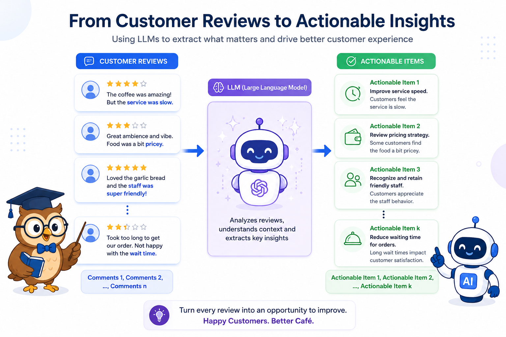

#### GENERATIVE AI • FOUNDATIONS

# Supercharge your app with Generative AI and Prompt Engineering

#### A hands-on guide to integrating large language models into your applications using proven prompt engineering techniques.

In today's world, many applications use **Generative AI** to deliver smarter, more personalized user experiences. In this article, we'll explore how you can incorporate generative AI into your own applications and learn practical **Prompt Engineering** techniques that help produce more accurate, reliable, and useful AI responses.

> **Assumption:** Rather than building an entire application, we'll focus exclusively on the **Generative AI** component. This functionality can be integrated into virtually any application, regardless of its overall architecture.

We'll use **Python** throughout this article because it is the most widely used programming language for AI development. However, the concepts and techniques discussed are language-agnostic—the only differences in other languages are the SDKs, libraries, and syntax.

If you're a non-technical reader, don't worry about understanding every line of code. Feel free to treat the code examples as a black box and focus on the underlying concepts and intuition behind how generative AI applications work.

## Let's build a simple real-world example

Suppose you own a café, and customers regularly leave reviews about your food, service, and overall experience. While reading every review manually is possible, it quickly becomes difficult as the number of reviews grows.

Instead of simply knowing whether a review is positive or negative, you want to identify **actionable insights** that can help improve the customer experience. For example, customers might mention slow service, friendly staff, long waiting times, or excellent coffee. These are valuable insights that can guide business decisions.

Since customers can write reviews in countless ways using different tones, styles, and levels of detail, extracting consistent information manually is challenging. This is where **Large Language Models (LLMs)** excel. We'll use an LLM to analyze each review and extract the key insights along with actionable items that the café owner can use to improve products and services.



Our solution will look something like this.

To begin, we'll implement the same solution using three different LLM providers:

- **OpenAI's GPT** series
- **Google's Gemini** series
- **Ollama**, which provides a free and locally runnable alternative

Once we've built the solution with each provider, we'll refactor it to make the implementation **Platform and LLM agnostic**, allowing us to switch between models with minimal code changes.

Finally, we'll improve the quality of the generated results by applying **Prompt Engineering** techniques and observing how even small changes to the prompt can significantly enhance the AI's responses.

<details>
<summary>We will use the following 10 comments throughout for benchmarking and comparing solutions</summary>

- The coffee was excellent and the pastries were fresh. However, it took almost 20 minutes for someone to take our order. The staff apologized, but the service definitely needs to be faster.
- Loved the ambience! It's a perfect place to work with free Wi-Fi and comfortable seating. I'll definitely be coming back.
- The cappuccino was average, and my sandwich arrived cold. The staff was friendly, but the kitchen seemed overwhelmed during lunch hours.
- Amazing desserts! The chocolate brownie is a must-try. The only downside was that finding a table during the evening was difficult.
- The café was clean, the staff greeted us with a smile, and our order arrived quickly. One of the best customer experiences I've had.
- The coffee tasted burnt and the music was so loud that we couldn't have a conversation. I expected much better.
- Great variety of beverages, but the prices are slightly higher than nearby cafés. Everything else was excellent.
- I ordered a latte with almond milk, but I received regular milk instead. Thankfully, the staff replaced it immediately without any hassle.
- The food was delicious, but the washroom wasn't clean. Small details like cleanliness make a big difference.
- Visited on a Sunday afternoon. There was a long queue, but once we got seated, the food and coffee were fantastic. It would help if there were more staff during weekends.

</details>

## Implementation using Open AI

First we need to get the API key for Open AI

1. Visit https://platform.openai.com
2. Sign in with your OpenAI account.
3. Complete account verification (if prompted).
4. Add a payment method or prepaid credits under Billing.
5. Navigate to API Keys.
6. Click Create new secret key.
7. Give your API key a name (optional but recommended).
8. Click Create secret key.
9. Copy and securely save the API key (it won't be shown again).
10. Place the key in a .env file in your code repository like below

```
OPENAI_API_KEY=<YOUR_OPENAI_API_KEY>
```

The implementation will look something like below

```python
def find_action_items(comments: list[str]) -> str:
    """_summary_

    Args:
        comments (list[str]): Customer reviews

    Returns:
        str: A list of actionable recommendations extracted from the reviews.
    """
    llm = OpenAI(api_key=os.getenv("OPENAI_API_KEY"))
    prompt = f"""Analyze the following comments and summarize the key action items considering the comments {"\n".join(comments)}."""
    action_items = llm.responses.create(model="gpt-5", input=prompt).output_text
    return action_items
```

<details>
<summary>And this is what we get as output</summary>

```
Here are the key action items distilled from the comments, prioritized by impact and frequency:

1) Speed and staffing
- Reduce order-taking wait times (target: greet within 2 minutes; orders placed within 5 minutes).
- Add floor/barista coverage during peaks (lunch, evenings, weekends); create a weekend staffing plan.
- Consider queue/waitlist tools, QR/mobile ordering, or a counter “runner” during rushes.

2) Kitchen throughput and food temperature
- Ensure hot items are served hot: add expo temperature checks, tighten holding/warming procedures, and review lunch-hour prep and line setup.
- Track ticket times (goal: <12 minutes at lunch) and adjust prep/pars as needed.

3) Beverage quality and consistency
- Address “burnt” coffee feedback: recalibrate grinders, verify brew/extraction temps, rotate beans properly, and tighten cleaning schedules.
- Refresh barista training and SOPs for espresso and milk texturing.

4) Order accuracy, especially milk/dietary requests
- Implement order read-back and cup labeling; require POS modifiers for alt-milks/allergens.
- Train on allergen protocol and cross-contamination prevention; add a final handoff check.

5) Seating and capacity management
- Ease evening and weekend crowding: introduce a waitlist/reservations for peak hours, bus tables faster, and add/redistribute seating where possible.
- If laptop use limits evening capacity, consider time or zone guidelines during peaks.

6) Noise and ambience control
- Set music volume standards by daypart; balance speaker zones to keep conversation-friendly levels.

7) Cleanliness, especially restrooms
- Institute hourly restroom checks with a visible log; ensure restocking and quick-response cleaning.
- Maintain overall café cleanliness consistency.

8) Pricing and value perception
- If keeping a slight premium, reinforce value with quality, portions, and speed.
- Consider loyalty program, bundle deals, or off-peak promos to offset price sensitivity.

9) Preserve strengths
- Keep up: friendly staff, fresh pastries/desserts, clean café, quick service when it works, free Wi‑Fi and comfortable seating.

Suggested KPIs to monitor
- Time to greet/order: ≤5 minutes
- Average ticket time (lunch): ≤12 minutes
- Drink/food accuracy: ≥99%
- Restroom checks: hourly, 100% compliance
- Music volume: maintain conversation-friendly levels
- Peak coverage: scheduled staffing meets forecasted demand
- Waitlist/table turn at peaks: average wait ≤10 minutes

These actions address slow service, kitchen delays, drink quality/accuracy, cleanliness, noise, and peak-time capacity while protecting what guests already love.
```

</details>
